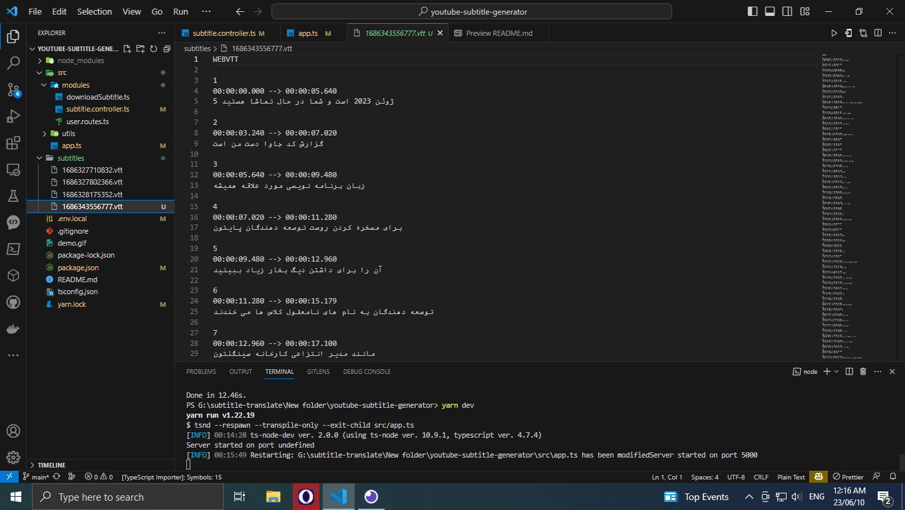

## Express.js rest api that generates subtitles, download video and audio seprately

Due to the importance of using YouTube content for learning different subjects and the lack of Persian subtitles for some videos or the poor quality of these subtitles, I have decided to create a personal server for subtitle creation using available libraries and APIs.

The workflow is as follows: when the text is entered into the server, it is translated once using Google Translate, and when the result is ready, the Persian text is rewritten once more using ChatGPT and ParaMent.

In this repository, I have used the Google API due to the open source format and ease of use for developers for YouTube subtitle. However, you can improve the translation quality by purchasing reputable services and replacing the API key with Google.

<p align="center">
    
</p>

### Api Endpoints

- /subtitles => generate persian subtitle
- /video720 => download video 720p
- /video1080 => download video 1080
- /audio => download audio separately
- /subtitles/:id => download subtitle

## 🔮 Usage

1. Make sure you have installed `node` already.

2. Simply `git clone` or download this repo, `cd` into the project folder.

3. Get your telegram token from the BOTFATHER. [Telegram token](https://telegram.me/BotFather)

4. Put your telegram token in `env.local` and rename it to `.env`

5. Install all modules

```sh
yarn
```

6. run developer server

```sh
yarn dev
```

## 💌 Resources

- [Telegram token](https://telegram.me/BotFather).
- [Deepl](https://www.npmjs.com/package/deepl-node).
- [Youtube dl](https://www.npmjs.com/package/youtube-dl-exec).
- [Express.js](https://github.com/expressjs/express).
